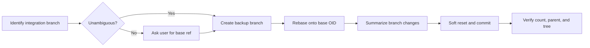

# Squash Commits Skill Plan

## Overview

Maintain a reusable skill that rebases the current Git branch onto the repository's default integration branch, then combines its commits into one summarized commit without requiring a pull request.

## Current Problem Analysis

Before this change, the skill forbade rebasing and created its backup only immediately before the soft reset. Adding a pre-squash rebase requires reliable default-branch detection and a backup that protects the entire history-rewriting operation.

## Call Chain / Architecture Diagram

## Strategy and Approach

Use native Git commands without scripts or GitHub integration. Prefer a user-supplied base; otherwise accept only an integration branch selected unambiguously by repository instructions or a remote symbolic `HEAD`. Create the backup before rebasing, abort and stop on rebase conflicts, and preserve exact post-rebase tree equality through the squash.

## Implementation Steps

- ✅ Remove the pull-request requirement and GitHub-specific workflow.
- ✅ Rename the skill to `squash-commits`.
- ✅ Add default-branch detection with a mandatory user question when ambiguous.
- ✅ Rebase before counting and squashing commits.
- ✅ Move backup creation before all history rewriting.
- ✅ Restrict the skill to explicit user invocation.
- ✅ Validate metadata and inspect the final files.

## Risk Assessment

- Wrong commit boundary: require an explicit base when automatic detection is ambiguous.
- Rebase conflicts: abort the rebase, verify restoration from the backup, and stop.
- Lost history: create a backup branch before rebasing or resetting.
- Changed content: verify the squashed commit's tree matches the post-rebase tree.
- Validator compatibility: the bundled `quick_validate.py` does not recognize `disable-model-invocation`; validate YAML parsing and cross-file invocation policy directly.

## Success Criteria

- Skill works without a pull request.
- The current branch is rebased onto an explicitly supplied or unambiguously identified integration branch before squashing.
- Ambiguous integration-branch detection stops for user input instead of guessing.
- Multiple current-branch commits become exactly one commit after the selected base.
- The squash preserves the rebased tree.
- Skill frontmatter and UI policy both disable implicit model invocation.
- Skill frontmatter and UI metadata parse successfully and agree on explicit-only invocation.

## Progress Tracking

- ✅ Implementation complete; YAML and explicit-only invocation checks passed. The bundled validator incompatibility is documented above.

## Related Files

- `squash-commits/SKILL.md`
- `squash-commits/agents/openai.yaml`
- `docs/plan/squash-commits-skill-plan.md`
